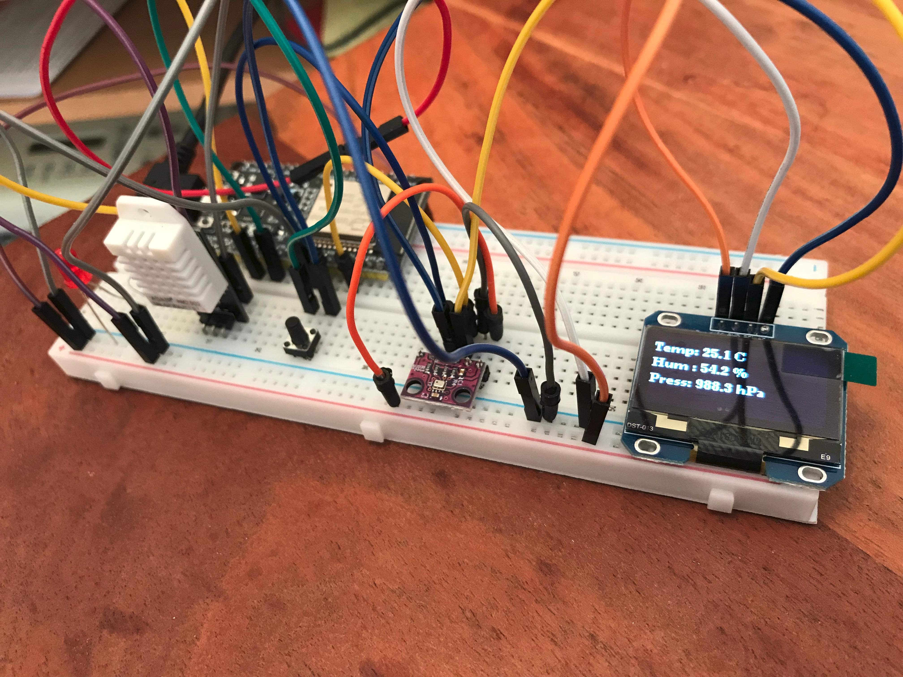

# 🌦️ Weather Station ESP32

<p align="center">
  
</p>

ESP32-based weather station with OLED user interface, historical data logging trend analysis.

---

## 🔧 Hardware

* ESP32-WROOM-32
* DHT22 (Temperature & Humidity) über GPIO
* BMP280 (Air Pressure) über I2C
* SH1106 OLED Display (I2C)
* Push Button

---

## ✨ Features

* Temperature measurement
* Humidity measurement
* Air pressure measurement
* Sea-level pressure correction
* OLED user interface
* Min / Max statistics
* Historical data buffer
* Temperature graph
* Humidity graph
* Pressure graph
* Weather tendency detection
* Screen saver mode
* Button-controlled navigation

---

## 📊 Wiring

| Component | Signal | ESP32 Pin |
| --------- | ------ | --------- |
| DHT22     | Data   | GPIO17    |
| BMP280    | SDA    | GPIO21    |
| BMP280    | SCL    | GPIO22    |
| OLED      | SDA    | GPIO21    |
| OLED      | SCL    | GPIO22    |
| Button    | Signal | GPIO16    |
| LED       | Output | GPIO2     |

---

## 📁 Project Structure

```text
src/
include/
lib/
platformio.ini
```

---

## OLED Screen

<p align="center">
  
</p>


---

## 🎯 Learning Goals

* ESP32 development
* Embedded software architecture
* Sensor integration
* OLED graphics
* Ring buffer data processing
* Historical trend analysis
* Modular C++ design
* WiFi connectivity
* NTP time synchronization

---

## 🚀 Planned Features

* OTA updates
* MQTT support
* Web dashboard
* Home Assistant integration
* PCB and protection case

## v2.1
- WiFi support
- Automatic reconnect
- NTP clock synchronization
- Redesigned main screen
- 24h stability test passed

### v2.0
- ESP32 port
- OLED UI
- History graphs

